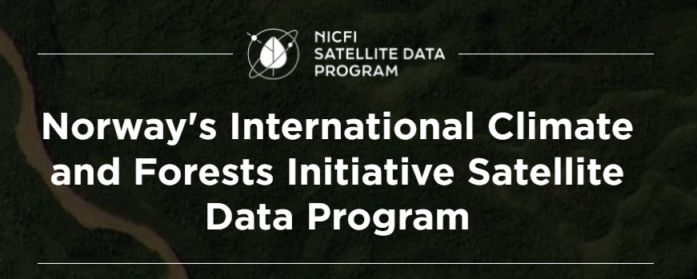

# Planet

Through *Norway's International Climate & Forests Initiative* (NICFI), users can now access Planet's high-resolution, analysis-ready mosaics of the world's tropics in order to help reduce and reverse the loss of tropical forests, combat climate change, conserve biodiversity, and facilitate sustainable development for non commercial uses.

> You can also try to get access to Planet product via the [Education and Research Program](https://www.planet.com/markets/education-and-research/)

## NICFI Program Data

The NICFI data products cover Archive (historical) data from December, 2015 - August, 2020 (one basemap every six months) and Monitoring (future) data from September, 2020 - August, 2022 (one basemap for each month). The Monitoring basemaps will be updated every month from September 2020 to 30 August 2022, with the possibility for extension for a further two years. All data products licensed through this program have a perpetual license meaning that data downloaded can continue to be used once the program has ended.

### PlanetScope Visual Mosaics

Optimised for visual display and interpretation, Visual Mosaics offer a “true-colour” representation of spatially accurate data with minimized haze, illumination, and topographic effects. These are ideal for users visually monitoring and interpreting satellite imagery.

Product Specifications:
- Area: Global tropical regions (see map below)
- Spatial resolution: 4.77m per pixel
- Spectral resolution: Red, Green, Blue (3-band)
- Temporal resolution
    - Archive from December, 2015 - August, 2020 at bi-annual cadence
    - Monitoring from September, 2020 - onwards at monthly cadence

### PlanetScope Surface Reflectance Mosaics (Analysis Ready)

Optimized for scientific and quantitative analysis, these mosaics offer an analytic or “ground truth” representation of spatially accurate data with minimized effects of atmosphere and sensor characteristics. These include a fourth band (near-infrared) and are suited for a variety of vegetation indices, including Normalized Difference Vegetation Index (NDVI), and more. These are ideal for users scientifically or quantitatively monitoring or interpreting satellite imagery.

Product Specifications:
- Area: Global tropical regions
- Spatial resolution: 4.77m  per pixel
- Spectral resolution: Red, Green, Blue, Near-Infrared (4-band)
- Temporal resolution
    - Archive from December, 2015 - August, 2020 at six month cadence
    - Monitoring from September, 2020 - onwards at monthly cadence

### Quads

Imagery within Planet basemaps is distributed as a grid of GeoTIFF files, which are called “basemap quads” or simply “quads”.

The projection used in Planet Basemaps has been selected to match what standard web mapping applications (Web Mercator Projection). The Alpha Mask indicates areas of the quad where there is no imagery data available.

## Data downloading and streaming

Users can download basemap quads and/or stream basemap tiles from the Planet Platforms and via integrations. Before users download or stream basemaps, they should understand how Planet names basemaps and how they are grouped together into the basemap series.

When users finish signing up for the NICFI Program, they are directed to the Planet Platform, Planet Explorer. Planet Explorer is a streaming web application for basemaps only. Users need to use alternative tools to download basemaps; Planet Basemaps Viewer, Mosaics API or integrations.

### Basemap Series

Planet stores multiple basemaps of the same temporal cadence under series names. Users will find the basemap series that they have access to on Planet’s Platform. The series included with the NICFI data are:
- PS Tropical Normalized Analytic Biannual
- PS Tropical Normalized Analytic Monthly

Within each series, there are basemaps at specific cadences that users have access to. Each basemap within the series is called:
- Bi-Annual: planet_medres_normalized_analytic_YYYY_MM_YYYY_MM_mosaic
- Monthly: planet_mederes_analytic_YYYY_MM_mosaic

The date in the name will change based on the date being visualized. You can also view the NICFI data through NICFI’s Purpose Allies, such as [Global Forest Watch](https://www.globalforestwatch.org/map/global/?map=eyJiYXNlbWFwIjp7InZhbHVlIjoicGxhbmV0IiwieWVhciI6MjAyMCwibW9udGgiOiIwMSJ9LCJkYXRhc2V0cyI6W3siZGF0YXNldCI6InBvbGl0aWNhbC1ib3VuZGFyaWVzIiwibGF5ZXJzIjpbImRpc3B1dGVkLXBvbGl0aWNhbC1ib3VuZGFyaWVzIiwicG9saXRpY2FsLWJvdW5kYXJpZXMiXSwib3BhY2l0eSI6MSwidmlzaWJpbGl0eSI6dHJ1ZX1dfQ%3D%3D).

### Planet Platforms

Here is a list of Planet Platforms that NICFI users can access. Users can log in using their Planet credentials created when signing up via the [NICFI Program Landing Page](https://www.planet.com/nicfi/).

#### Planet Explorer

[Planet Explorer](https://www.planet.com/explorer/) is a Planet web application designed to view imagery ranging from daily scenes to weekly, monthly and quarterly basemaps. When users sign up for the NICFI Program, and fill out the form with their information, they are directed to this web application.  You can use Planet Explorer to view the tropical basemaps and analyze the tropical basemaps in the browser, including enhancing pixels and applying spectral indices. Currently, you can not download basemaps through Planet Explorer. Find out more about Planet Explore, and all the ways you can view and analyze the tropical basemaps within it, by reading the [Planet Explorer User Guide](https://developers.planet.com/docs/apps/explorer/).

#### Basemaps Viewer

[Basemaps Viewer](https://www.planet.com/basemaps/) is an online tool used to view and download basemaps. You can use Basemaps Viewer to view the tropical basemaps, download basemap quads, and find out which scenes were used to create the basemap quads. Find out more about Basemaps Viewer by reading the [Basemaps Viewer User Guide](https://developers.planet.com/docs/basemaps/).

Planet recommends using the Basemaps Viewer if you are seeking to download a small subset of the tropical basemaps (basemap quad(s)). For more detailed instructions on downloading the basemap quad(s), please read this section of the [user guide](https://developers.planet.com/docs/apps/basemapsviewer/download-basemaps/).