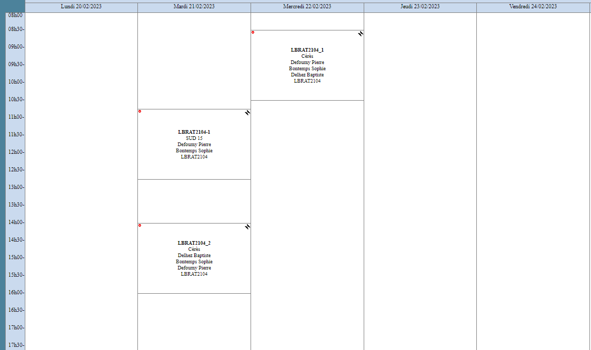

# Agenda

*Academic year - 2022-2023*

| Week        |      Topic      |
|-------------|:---------------:|
| S3 - 20 feb | Region of interest + EO data download |
| S4 - 27 feb | Sentinel-2 preprocessing  |
| S5 - 06 mar | Sentinel-1 & Landsat with GEE  |
| **.. march** | **Livrable 1**  |
| S6 - 13 mar | Vector data      |
| S7 - 20 mar | Classification 1/2  |
| S8 - 27 mar | Classification 2/2  |
| **.. march** | **Livrable 2**  |
| Easter Holidays |  -  |
| Easter Holidays |  -  |
| S9 - 17 apr  | Zonal statistics  |
| S10 - 24 apr | Composites   |
| **.. apr** | **Livrable 3**  |
| S11 - 01 may |    |
| S12 - 08 may | Tutoring |
| S13 - 15 may | Tutoring |
| **.. may** | **Livrable 4 - Final version**  |

---

LBRAT2104 course schedule - Cérès Room 