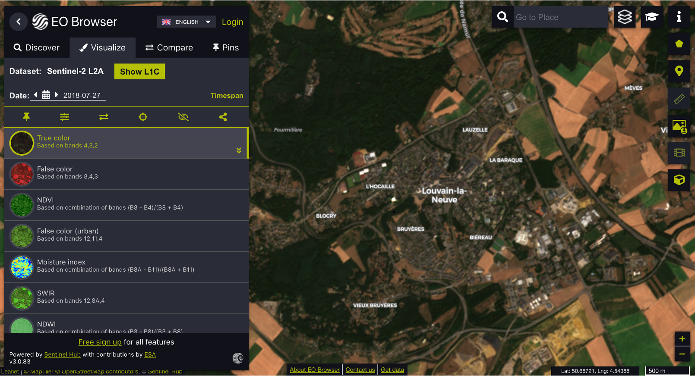

# Sentinel Hub EO Browser

[EO Browser](https://www.sentinel-hub.com/explore/eobrowser/) allows you to visualize satellite data from numerous satellites and data collections instantly. The process in the background takes care of the selection of appropriate scenes, download and processing of data, as well as mosaic creation. You simply go to your area of interest, select your desired time range and cloud coverage, and inspect the resulting data in the browser.

```{warning}
It is NOT recommended to download EO data from this site.
```

