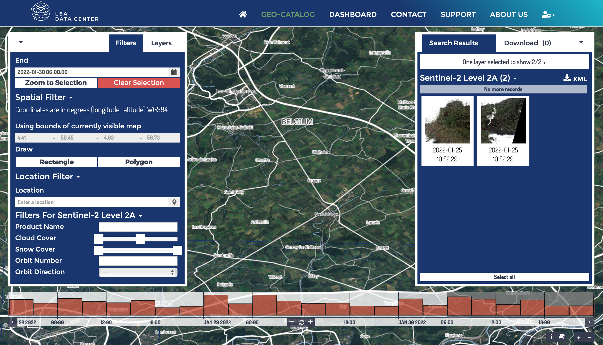

# Luxembourg Space Agency Data Center

The [Luxembourg Space Agency Data Center](https://collgs.lu)  is the Luxembourg entry point to data products of Sentinel 1 and Sentinel 2 constellations.

The LSA Data Center allows the users to search, discover and download the data. To this purpose all the data are referenced and indexed in a real time updated geo-catalogue. The catalogue allows the users to query the archive on the basis of specific criteria such as product type, orbit, cloud coverage or polarisation mode and to select the needed products for the download.

```{note}
Only Sentinel-2 Level 2A and Sentinel-1 Level 1 (GRD) are available via the LSA Data Center. 
```

