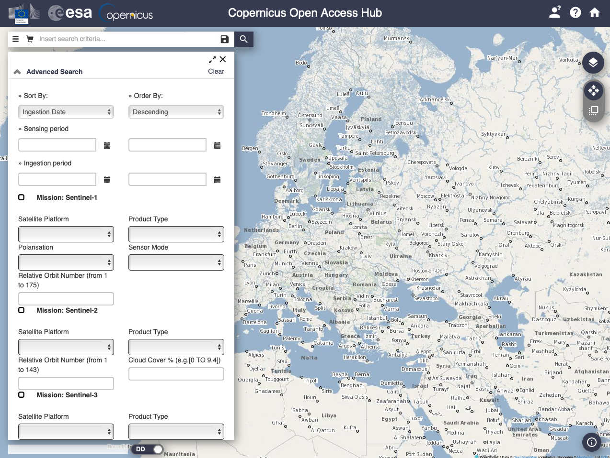

# Copernicus Open Access Hub - SciHub

The [Copernicus Open Access Hub](https://scihub.copernicus.eu) provides complete, free and open access to Sentinel-1, Sentinel-2, Sentinel-3 and Sentinel-5P user products.

```{note}
Most recently published products are kept online according to a sliding window period of **at least one month**. At the end of the retention period, products are removed from the online storage. The information on the product is kept on the catalogues. The products are tagged on the GUI with an "offline" label. The download request of an offline product, automatically triggers the request for restoring the product back online from the historical archive. Once restored (eg: online) the product(s) can be downloaded by the user. Download of restored products does not start automatically. It needs to be initiated as a normal download. [More info about data restoration](https://scihub.copernicus.eu/userguide/DataRestoration)
```

## Download from the Graphical User Interface




## Download from the sentinelsat Python API

`sentinelsat` makes searching, downloading and retrieving the metadata of Sentinel satellite images from the *Copernicus Open Access Hub* easy.

```{toctree}
:maxdepth: 1

S2_data_download
S1_data_download

```