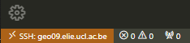
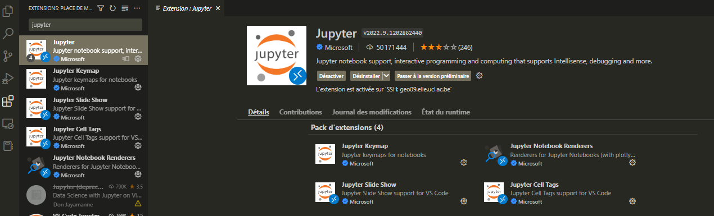
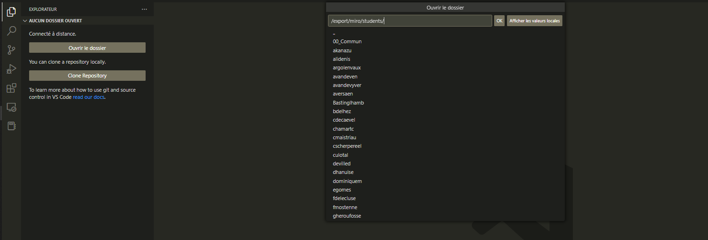
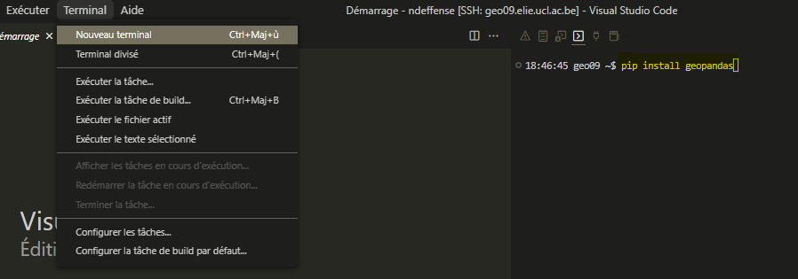

# From lab’s servers

```{note}
Only for students with access to the lab’s IT infrastructure

Don't forget to activate your VPN if you're not connected in eduroam WIFI !
```

## Visual Studio Code (*recommanded*)

1. Open VS Code and connect to Linux server Geo09 (*geo09.elie.ucl.ac.be*)



<font size="2">Check if you are well connected to the server on the bottom left corner.</font>

2. Install `Jupyter` and `Python` extensions



<font size="2">Install “Jupyter" and "Python" extension. You may need to install others extensions. You will need to do these steps only once. </font>

3. Navigate to the folder where the Jupyer Notebooks are stored



4. Some python librairies are not installed by default. If it is the case, you will get an error message when you will try to import them. To install a python library, you have to open a terminal and use the `pip` command.



<font size="2">Install `geopandas` library using `pip install`. You will need to do this step only once. </font>

5. You can now open a Jupyter Notebook (or a python script) and take advantage of the storage space and computing power of the lab's servers !

## Anaconda on Geo14

1. Connect to Windows server Geo14 (*geo14.elie.ucl.ac.be*)

2. Open *Anaconda Prompt*

3. Activate **LBRAT2104**'s environment
    ```console
    conda activate G:\conda_env\lbrat2104
    ```
    *The name of the environment must appear before the name of the disk*  
    `(G:\conda_env\lbrat2104) C:\>`

4. Go to home disk, the disk where you stored all you data
    The home disk (\\\\geo12\homes) must be map before (via *This PC > Map network drive...*)   
    You can map the disk with another letter than H

    ```sh
    H:
    ```

5. Launch JupyterLab
    ```sh
    jupyter lab
    ```
    
    By default, JupyterLab opens in Internet Explorer and this does not work. You need to copy the URL link and paste it into Google Chrome instead.

6. Navigates to the folder where the notebooks are located
    
    You can download all the content of this git by clicking on "Code>Download ZIP".