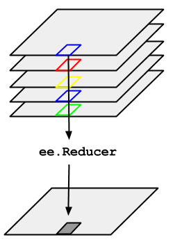

# Composite

Reducers are the way to aggregate data over time, space, bands, arrays and other data structures in Earth Engine. The `ee.Reducer` class specifies how data is aggregated. The reducers in this class can specify a simple statistic to use for the aggregation (e.g. minimum, maximum, mean, median, standard deviation, etc.), or a more complex summary of the input data (e.g. histogram, linear regression, list).

Reductions may occur over :
- **time (`imageCollection.reduce()`),**
- space (`image.reduceRegion()`, `image.reduceNeighborhood()`),
- bands (`image.reduce()`),
- attribute space of a `FeatureCollection`** (`featureCollection.reduceColumns()` or `FeatureCollection` methods that start with `aggregate_`).


Consider the example of needing to take the median over a time series of images represented by an `ImageCollection`. To reduce an `ImageCollection`, use `imageCollection.reduce()`. This reduces the collection of images to an individual image. Specifically, the output is computed pixel-wise, such that each pixel in the output is composed of the median value of all the images in the collection at that location. To get other statistics, such as mean, sum, variance, an arbitrary percentile, etc., the appropriate reducer should be selected and applied.

```{note}
For basic statistics like min, max, mean, etc., `ImageCollection` has shortcut methods like `min()`, `max()`, `mean()`, etc. They function in exactly the same way as calling `reduce()`, except the resultant band names will not have the name of the reducer appended.
```

**To composite images in an `ImageCollection`, use `imageCollection.reduce()`. This will composite all the images in the collection to a single image representing, for example, the min, max, mean or standard deviation of the images.**





## Composite over a single time period 


```js
var startPeriod = '2019-01-01'
var endPeriod   = '2019-03-31'
```

```js
// Compute mean over a period and clip to the ROI extent

var s1_mean = s1_filter
                    .filterDate(startPeriod, endPeriod)
                    .reduce(ee.Reducer.mean())
                    .clip(roi)
```

```js
// Compute standard deviation over a period and clip to the ROI extent

var s1_std  = s1_filter
                    .filterDate(startPeriod, endPeriod)
                    .reduce(ee.Reducer.stdDev())
                    .clip(roi)
```


## Composite over mulitple time periods


```js
// List of months
var months = ee.List.sequence(1, 12)
print("Months : ",months)

// List of years
var years = ee.List.sequence(2019, 2019)
print("Years : ",years)

// Use .map() to compute monthly composite and clip them to the ROI
var monthly_mean = ee.ImageCollection.fromImages(
  years.map(function (y) {
        return months.map(function (m) {
                return s1_filter
                        .filter(ee.Filter.calendarRange(y, y, 'year'))
                        .filter(ee.Filter.calendarRange(m, m, 'month'))
                        .reduce(ee.Reducer.mean())
                        .set('year',y)
                        .set('month',m);
            });
  })
  .flatten())
  .map(function(image){return image.clip(roi)})
```

[Source](https://gis.stackexchange.com/questions/387012/google-earth-engine-calculating-and-plotting-monthly-average-ndvi-for-a-region)


