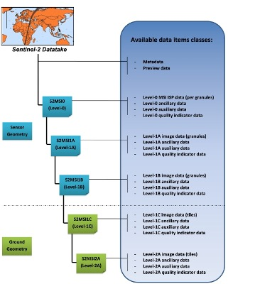
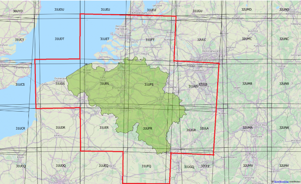
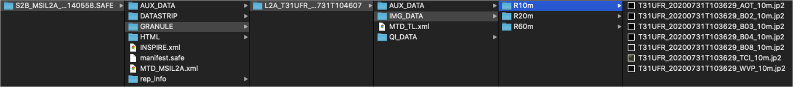

# Processing Levels

## Level-1C
**Level-1C** product provides orthorectified *Top-Of-Atmosphere* (TOA) reflectance, with sub-pixel multispectral registration. Cloud and land/water masks are included in the product.

## Level-2A
**Level-2A** product provides orthorectified *Bottom-Of-Atmosphere* (BOA) reflectance, with sub-pixel multispectral registration. A Scene Classification map (cloud, cloud shadows, vegetation, soils/deserts, water, snow, etc.) is included in the product.

The Level-2A operational processor ([Sen2Cor](http://step.esa.int/main/snap-supported-plugins/sen2cor/)) generates Level-2A (BOA reflectance) products from Level-1C products.
This processing is split into two parts:
- Scene Classification (SC) algorithm aims at providing a pixel classification map
- Atmospheric Correction (S2AC) aims at transforming TOA reflectance into BOA reflectance.


> From the mid-March 2018, the Level-2A became an operational product, beginning with coverage of the Euro-Mediterranean region. Global coverage started in December 2018.



<font size="2">Sentinel-2 processing levels. Only Level-1C and Level-2A products (in green) are made available to users</font>


Level-1C and Level-2A are projected onto a UTM/WGS84 grid and made available publicly on 100x100 km tiles. Each tile has a unique ID. Take a look on the Sentinel-2 UTM tiling grid by clicking [here](https://eatlas.org.au/data/uuid/f7468d15-12be-4e3f-a246-b2882a324f59) !



<font size="2">Sentinel-2 tiles in Belgium. Three tiles cover the majority of the Belgian territory: 31UES, 31UFS and 31UFR </font>


# Spectral bands & spatial resolution

The spatial resolution of Sentinel-2 is dependent on the particular spectral band.

|10m spatial resolution | 20m spatial resolution | 60m spatial resolution|
|:---------:|:----------: |:----------: |
| B2 (490 nm) | B5 (705 nm) | B1 (443 nm)
| B3 (560 nm) | B6 (740 nm) | B9 (940 nm)
| B4 (665 nm) | B7 (783 nm) | B10 (1375 nm)
| B8 (842 nm)| B8a (865 nm)
| | B11 (1610 nm)
| | B12 (2190 nm)


# Data Formats

Sentinel-2 products are made available to users in *SENTINEL-SAFE* format, including image data in JPEG2000 format, quality indicators (e.g. defective pixels mask), auxiliary data and metadata.

The SAFE format has been designed to act as a common format for archiving and conveying data within ESA Earth Observation archiving facilities. The SAFE format wraps a folder containing image data in a binary data format and product metadata in XML. This flexibility allows the format to be scalable enough to represent all levels of SENTINEL products.

A Sentinel-2 product refers to a directory folder that contains a collection of information. It includes:
- a manifest.safe file which holds the general product information in XML
- a preview image in JPEG2000 format
- subfolders for measurement datasets including image data (granules/tiles) in GML-JPEG2000 format
- subfolders for datastrip level information
- a subfolder with auxiliary data (e.g. International Earth Rotation & Reference Systems (IERS) bulletin)
- HTML previews


The Level-2A prototype product is an orthorectified product providing Bottom-Of-Atmosphere (BOA) reflectances, and basic pixel classification (including classes for different types of cloud).

The Level-2A image data product uses the same tiling, encoding and filing structure as Level-1C.

The Level-2 product is also in SAFE format, which groups together several types of file:
- metadata file (XML file)
- preview image (JPEG2000 with GML geo-location)
- tiles files with BOA reflectances image data file (GML / JPEG2000) for each tile
- datastrip files
- auxiliary data
- ancillary data (Ground Image Processing Parameters (GIPPs))




```{note}
Before starting this notebook, you should download Sentinel-2 Level-2A products. The L2A products are downloadable by tiles which are 100x100 km ortho-images in UTM/WGS84 projection.
```
